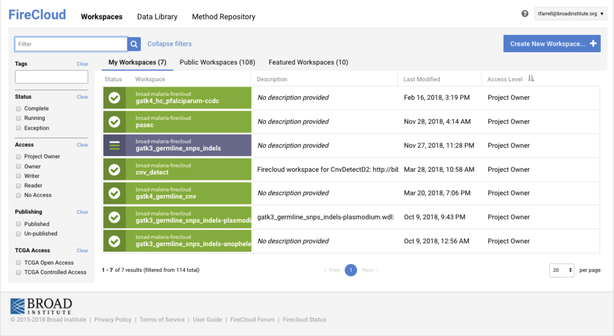

### broad-malaria-firecloud 
------- 

Workflow description language ([WDL](https://software.broadinstitute.org/wdl/)) workflows for scalable, genomic analyses employed by the Malaria Group, Infectious Disease and Microbiome Program at the Broad Institute. See my talk on the topic [here](https://github.com/tmfarrell/broad_malaria_firecloud/blob/master/20181128-microbial_meeting_broad_malaria_firecloud-talk.pdf).

#### usage notes 

These are intended for use on [FireCloud](https://portal.firecloud.org) (now Terra), but can also be adapted for/ executed on a cluster or local machine using [Cromwell](https://github.com/broadinstitute/cromwell).  

See [here](https://software.broadinstitute.org/firecloud/) for more information on how to access and use FireCloud. See [here](http://cromwell.readthedocs.io/en/develop/) for more information on Cromwell.

